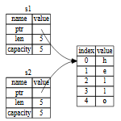
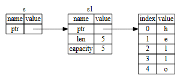

# Some Concepts

## 1.type system

### 1.1 Scalar Types
<!-- **int**    
**float**  
**bool**  
**char**    
**String**  
**&str**  -->
|**Type**  | **Instant**|
|---| ----------|
|***Int***| i32 u32  |
|***Float***| float32 float64 |
|***Boolean***| true  false  |
|***Char***| 'z' |
 

### 1.2 Compound Types
**stuct**  
**enum**   
**array**
**tuple** 

## 2.variables
pattern  

## 3.loop
----if  
----loop  
----while  
----for  

## 4.ownership
### 4.1 ownership
<!-- 1. at the same time, a value just only have one owner
2. if the ownership have moved, the original variable would invalid
3.  -->
Each value in Rust has an owner.  
There can only be one owner at a time.  
When the owner goes out of scope, the value will be dropped.  

**impl copy trait**  
***>All the integer types, such as u32.***  
***>The Boolean type, bool, with values true and false.***    
***>All the floating-point types, such as f64.***    
***>The character type, char.***    
***>Tuples, if they only contain types that also implement Copy. For example, (i32, i32) implements Copy, but (i32, String) does not.***   

### 4.2 borrow and reference

**Reference Rules**  
***>At any given time, you can have either one mutable reference or any number of immutable references.***  
***>References must always be valid.***

## 5.generic

## 6.trait

## 7.lifetime

## 8.closure

## 9.smart pointer

## 10.about core && alloc && std crates
